# Face Recognition Attendance System  
**Internal Team README – Development & Implementation Guide**

---

## Purpose of This Document

This README is written **for project team members**.  
Its goal is to help every developer:
- Understand how the system works
- Know where each part of the code lives
- Set up the project environment correctly
- Contribute without breaking existing functionality

If you are new to the project, **start from the Overview and read sequentially**.

---

## 1. Project Overview

The **Face Recognition Attendance System** is a computer vision–based application that automatically records attendance using facial recognition.

Instead of manual attendance or physical biometric devices, the system:
1. Captures live video from a camera
2. Detects human faces in each frame
3. Recognizes faces by comparing them with registered users
4. Records attendance (name, date, time) automatically

The project is designed to be **modular**, meaning each major responsibility (detection, recognition, attendance logic, storage) is implemented as a separate component. This allows multiple team members to work in parallel without conflicts.

---

## 2. What the System Does (Functional Summary)

At a high level, the system performs the following tasks:

- Reads video input from a webcam
- Detects faces in real time
- Converts detected faces into numerical encodings
- Matches encodings against known users
- Marks attendance only once per person per session/day
- Saves attendance records persistently

This flow should always be kept in mind when working on or modifying the code.

---

## 3. Key Features (For Developers)

- Modular face detection and recognition pipeline
- Clear separation between logic and data storage
- Easy-to-extend architecture (e.g., database, web interface)
- Simple and readable data formats for debugging
- Designed for both experimentation and production hardening

---

## 4. Technology Stack (What We Use and Why)

### Programming Language
- **Python 3.9+**
  - Wide ecosystem for computer vision
  - Strong community support

### Core Libraries
- **OpenCV (`cv2`)**
  - Camera access
  - Frame capture and preprocessing

- **face_recognition**
  - Face encoding and comparison
  - Built on `dlib` for reliable accuracy

- **NumPy**
  - Efficient numerical operations on image data

- **Pandas**
  - Reading, writing, and managing attendance records

### Data Storage
- **CSV** (default, easy to debug)
- **SQLite** (optional upgrade for scalability)

---

## 5. System Architecture Overview
The application follows a modular **multi-tier architecture**, separating the user interface, processing logic, and data storage to ensure scalability and maintainability.

* **Client Layer:** Serves as the entry point for users (Students and Lecturers) via standard web browsers.
* **Frontend Layer:** Manages the user interface and interacts with the device hardware. It captures real-time video frames from the webcam and sends them to the server.
* **Backend Layer:** The core of the application. It hosts the API controller for routing requests and the **Face Recognition Engine**, which handles face detection, encoding generation, and matching algorithms.
* **Data Layer:** Persists all critical information, including student profiles, face encodings, and attendance logs.

**Data Flow**
Images captured in the *Frontend* are processed by the *Backend* to extract facial features. These features are matched against the *Data Layer*, and the resulting attendance status is returned to the *Client*.


The system follows a **pipeline architecture**. Each stage receives data, processes it, and passes it forward.

```text
+------------------+
|   Camera Input   |
+------------------+
         |
         v
+------------------+
|  Face Detection  |
|     (OpenCV)     |
+------------------+
         |
         v
+------------------+
| Face Recognition |
|   (Encodings &   |
|    Matching)     |
+------------------+
         |
         v
+------------------+
| Attendance Logic |
|  (Validation &   |
|  Deduplication)  |
+------------------+
         |
         v
+------------------+
|   Data Storage   |
|  (CSV / SQLite)  |
+------------------+
```

### Team Guidance
- **Do not mix responsibilities** across layers
- Changes to recognition logic should not affect storage logic
- Each block above maps directly to code modules

---

## 6. System Flow (Runtime Behavior)
This flow describes **what happens when the system is running**.


### Team Guidance
- Attendance validation logic **must always prevent duplicates**
- Recognition should be stateless; attendance is stateful

---

## 7. Data Flow Diagram (DFD)
This diagram focuses on **how data moves**, not control flow.


---

## 8. Database Design 

### Lecturer Table Structure

| Field        | Type     | Description |
|-------------|----------|-------------|
| id          | Integer  | Unique record ID (Primary Key) |
| lecturer_id | String   | Unique lecturer identifier (login ID) |
| name        | String   | Lecturer full name |
| course_code | String   | Course assigned to the lecturer |
| password    | String   | Hashed password for authentication |
| created_at | DateTime | Date and time the account was created |

### Students Table

| Field        | Type      | Description |
|-------------|-----------|-------------|
| id          | Integer   | Unique record ID (Primary Key) |
| student_id  | String    | Unique matriculation number |
| name        | String    | Student full name |
| created_at | DateTime  | Enrollment date and time |


### Attendance Table Structure

| Field | Type | Description |
|-----|-----|------------|
| id | Integer | Unique record ID |
| name | String | Recognized person |
| date | Date | Attendance date |
| time | Time | Time of recognition |
| status | String | Present |

### Design Rules
- One attendance entry per person per day
- `(name, date)` should be unique
- Storage layer must be replaceable without breaking logic

### Entity-Relationship Daigram

```mermaid
erDiagram
    STUDENTS {
        INTEGER id PK
        TEXT student_id UK
        TEXT name
        DATETIME created_at
    }

    LECTURERS {
        INTEGER id PK
        TEXT lecturer_id UK
        TEXT name
        TEXT course_code
        TEXT password
        DATETIME created_at
    }

    FACE_ENCODINGS {
        INTEGER id PK
        INTEGER student_id FK
        BLOB encoding_data
        DATETIME created_at
    }

    ATTENDANCE {
        INTEGER id PK
        INTEGER student_id FK
        INTEGER lecturer_id FK
        TEXT course_code
        DATE date
        TIME time
        TEXT status
    }

    STUDENTS ||--o{ ATTENDANCE : "marks"
    LECTURERS ||--o{ ATTENDANCE : "manages"
    STUDENTS ||--|| FACE_ENCODINGS : "has"
```


---

## 9. Evaluation Metrics (How We Measure Performance)

### Recognition Quality
- **Accuracy**  
Accuracy = Correct Predictions / Total Predictions

- **Face Acceptance Rate (FAR)**
- **Face Rejection Rate (FRR)**

### System Performance
- Frame processing time
- Recognition latency
- Stability under multiple faces

These metrics are important when optimizing or refactoring.

---

## 11. Project Structure (How the Repository Is Organized)

This section explains **where things live in the repository and what each folder/file is responsible for**.  
Every team member should understand this before writing or modifying code.

### High-Level Repository Structure

```text
face-recognition-attendance/
├── data/
├── models/
├── src/
├── notebooks/
├── scripts/
├── tests/
├── requirements.txt
├── README.md
├── .gitignore
└── LICENSE

```

Each directory has a **single, clear responsibility**. Do not place files arbitrarily.

---

## 11.1 `data/` – Dataset & Attendance Records

This folder contains **all data used or generated by the system**.

### Folder Responsibilities
- **`raw/`**
  - Stores registered users’ face images
  - Each person must have **their own folder**
  - Folder name = person’s name (used for recognition labels)

- **`processed/`**
  - Stores generated outputs
  - Attendance logs (CSV or SQLite)

- **`samples/`**
  - Optional demo or test images
  - Used for experiments and debugging

### Team Rules
- Do not commit large datasets unless agreed
- Keep images clear and well-lit
- Do not change folder naming conventions

---

## 11.2 `models/` – Face Encodings & Model Artifacts

This folder contains **trained data**, not training code.

### Folder Responsibilities
- **`trained/`**
  - Stores generated face encodings
  - Output of the training/encoding step

- **`pretrained/`**
  - Reserved for future pretrained models (if needed)

- **`model_utils.py`**
  - Helper functions for loading/saving encodings

### Team Rules
- Do not hardcode paths to model files
- Regenerate encodings if new users are added

---

## 11.3 `src/` – Core Application Code

This is the **most important directory**.  
All production code lives here.


